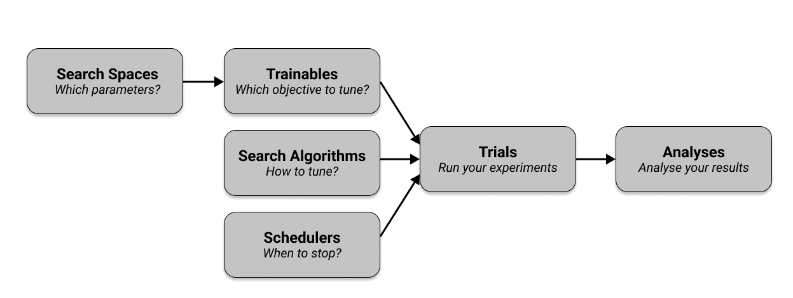

# Lab: Scalable Hyperparameter Optimization with Ray Tune


## 1. Ray & Ray Tune


### What is Ray?

Ray is an open-source, distributed execution framework designed to scale Python applications from a single laptop to a massive High-Performance Computing (HPC) cluster. It completely abstracts away the complexities of traditional network programming, socket management, and manual data synchronization.

### Key Components of Ray Architecture

* **The Head Node:** The central orchestrator of the cluster. It hosts the Global Control Store (GCS), which tracks the location of data objects, worker states, and tasks across the entire network.

* **Worker Nodes:** The physical or virtual cluster machines (e.g., your Slurm allocated nodes) that receive and execute the actual computation payloads.

* **Tasks (Stateless Parallelism):** Functions executed asynchronously across the cluster using the `@ray.remote` decorator.

* **Actors (Stateful Parallelism):** Microservices/classes running on the cluster that preserve their internal state across multiple calls.


---


### What is Ray Tune?

Building on top of Ray's core ecosystem, Ray Tune is a library specifically engineered for hyperparameter tuning at scale.


When training machine learning models, finding the optimal combination of configuration parameters (like learning rates, tree depths, or network architectures) requires running hundreds of independent training cycles. Ray Tune automates this process cleanly by turning hyperparameter search into a distributed scheduling problem.


### The Ray Tune Workflow




* **Search Spaces:** You define boundaries for your variables (e.g., Uniform, Log-Uniform, Grid, or Random choices) instead of picking hardcoded parameters.

* **Search Algorithms:** Instead of blindly guessing parameters, it builds a statistical probability model based on previous trial results to mathematically choose the next best configuration.

* **Trial Schedulers:** Implements aggressive early-stopping routines like **ASHA (Asynchronous Successive Halving Algorithm)**. ASHA continuously evaluates live trials against each other. If a configuration is performing poorly, ASHA terminates it mid-flight, freeing up cluster cores to instantly pull a new configuration from the search algorithm.


## 2. Environment Setup

To run distributed machine learning workloads seamlessly across an HPC cluster, all computing nodes must run identical software versions. We will use a Conda environment to isolate our dependencies and prevent package conflicts.


Log into your cluster terminal and execute the following commands to initialize your environment using Python 3.10 and install all requirements provided in file `reqiuremnts.txt`:


```bash

# Create a new, clean conda environment named 'rayenv'

conda create -y -n rayenv python=3.10


# Initialize your shell for conda usage (if not done previously)

conda init bash

source ~/.bashrc


# Activate the environment

conda activate rayenv


# Install the dependencies via pip

pip install -r requirements.txt

```


## 3. Hyperparameter Tuning & XGBoost

To optimize machine learning pipelines on a cluster, you must understand what parameters we are tuning and why the underlying algorithm is chosen for high-performance benchmarks.


### Understanding Hyperparameter Tuning

In machine learning, there is a fundamental distinction between two types of parameters:


* **Model Parameters:** Internal configurations learned automatically by the algorithm from the training data during execution (e.g., split thresholds in a decision tree or weights in a neural network).

* **Hyperparameters:** External configurations that you must set manually before training begins. These govern the structural complexity of the model and how aggressively it learns.


Because hyperparameters directly control the balance between underfitting (model is too simple) and overfitting (model memorizes noise in the training data), finding their optimal values is critical. Instead of manual guessing, we use automated search spaces to evaluate multiple configurations systematically.


---


### What is XGBoost?

In our benchamrks we will use XGBoost which stands for eXtreme Gradient Boosting. It is an open-source, state-of-the-art implementation of gradient-boosted decision trees designed precisely for speed, scalability, and prediction accuracy.


Instead of training one massive, complex model, XGBoost uses an ensemble technique called Boosting:


1. It trains a very simple, weak decision tree first.

2. It analyzes the errors (residuals) made by that first tree.

3. It trains a second decision tree designed specifically to fix the mistakes of the first one.

4. This sequential process repeats hundreds of times, adding trees together to form a highly accurate final model.


## 4. Model training

Now that the architectural concepts are established, we can examine how they materialize in actual code. The following implementation represents the computational unit that Ray Tune will repeatedly execute across the cluster.


Unlike a traditional sequential machine learning script where data is loaded and a model is trained exactly once, Ray Tune transforms the training process into a distributed trial execution system, where the same training function is instantiated many times in parallel, each with a different hyperparameter configuration.


Conceptually:


```

Trial 1 → {learning_rate=0.01, max_depth=6}

Trial 2 → {learning_rate=0.05, max_depth=8}

Trial 3 → {learning_rate=0.2,  max_depth=4}

Trial 4 → {learning_rate=0.005,max_depth=12}

...

```


Each trial executes an independent copy of the function below somewhere on the cluster with its own config:


```python

def train_model(config):

    X = config["data_X"]

    y = config["data_y"]


    if isinstance(X, ray.ObjectRef):

        X = ray.get(X)

    if isinstance(y, ray.ObjectRef):

        y = ray.get(y)


    num_cpus = config.get("num_cpus", 16)


    model = XGBClassifier(

        n_estimators=config["n_estimators"],

        max_depth=config["max_depth"],

        learning_rate=config["learning_rate"],

        tree_method="hist",

        n_jobs=num_cpus,

        verbosity=0,

        random_state=42

    )


    scores = cross_val_score(model, X, y, cv=3, n_jobs=1)

    return np.mean(scores)

```

To make sure this function will work for baseline and ray job, we make sure if `X` and `y` are reffreences for ray storage in case of ray job, or plain data in case of baseline job.


```python

if isinstance(X, ray.ObjectRef):

    X = ray.get(X)

if isinstance(y, ray.ObjectRef):

    y = ray.get(y)

```

## 5. Baseline

Before introducing Ray Tune's intelligent scheduling and distributed optimization algorithms, we need a baseline implementation that represents the "traditional" approach to hyperparameter optimization.


The purpose of this implementation is not to optimize efficiently. Instead, it serves as a controlled benchmark against which Ray Tune can later be compared.


The underlying philosophy of random search is extremely simple:


1. Define valid parameter ranges.

2. Randomly sample configurations.

3. Train a model for each sampled configuration.

4. Record the resulting performance.

5. Keep the best configuration discovered.


Below we can see the implementation of that:


```python

def run_baseline_trial(trial_id, num_samples=50 ,seed=None):

    if seed is None:

        seed=trial_id*42

    set_seeds(seed)


    X, y = load_and_preprocess_data()


    results = []


    for i in range(num_samples):


        config = {

            "n_estimators": random.randint(100, 1000),

            "max_depth": random.randint(4, 15),

            "learning_rate": 10 ** random.uniform(-4, -1),

            "data_X": X,

            "data_y": y,

            "num_cpus": 16,

        }


        score = train_model(config)


        results.append(

            {

                "config": config,

                "accuracy": score,

            }

        )


    return results

```


To run this code on Ares we are going to use scrfipt dedicated for SLURM. In the script below we declare an array job that will run on 4 nodes and giving each node one task to try to match ray worker nodes architecture for the best comparision. For each task node can use up to 16 cpu.

```bash

#!/bin/bash -l

#SBATCH --array=1-4

#SBATCH --nodes=1

#SBATCH --ntasks-per-node=1

#SBATCH --cpus-per-task=16

#SBATCH --time=00:30:00

#SBATCH --partition=plgrid

#SBATCH --account=plglscclass26-cpu

#SBATCH --output=baseline_%A_%a.out


conda activate rayenv


python -u run_baseline.py

```


As you can see script is pretty small and easy to understand.


## 6. Ray

Now we transition from the baseline to **Ray Tune**, which transforms your cluster into a single, cohesive optimization engine. While the baseline runs independent tasks that don't talk to each other, **Ray Tune** uses a centralized orchestrator to make "smart" decisions in real-time.


We wrap our training logic in an objective function which reports results back to Ray using `tune.report()`. This feedback loop allows the scheduler to see how a trial is performing while it is still running.


```python

def objective(config):

    start = time.time()


    trainer_config = config.copy()

    trainer_config["n_estimators"] = int(np.round(config["n_estimators"]))

    trainer_config["max_depth"] = int(np.round(config["max_depth"]))


    score = train_model(trainer_config)


    duration = time.time() - start

    resources_end = log_resources()


    tune.report({

        "accuracy": score,

        "training_time": duration,

        "cpu_usage": resources_end["cpu_percent"],

        "memory_gb": resources_end["memory_gb"]

    })

```


The dataset is moved into shared memory using `ray.put()`. This stores the data within the **Plasma Object Store**, making it accessible to all processes on the node. Workers receive a pointer and read the data directly from shared memory without creating redundant copies.


Hyperparameter ranges are defined using a search space with distributions like `tune.uniform` and `tune.loguniform` to explore different model configurations.


The tuner uses a scheduler (ASHA) that identifies and terminates underperforming trials early to conserve cluster resources.


Finally, calling `tuner.fit()` launches the distributed execution, managing the parallel trials across the cluster.


```python

X, y = load_and_preprocess_data()


X_ref = ray.put(X)

y_ref = ray.put(y)


search_space = {

    "n_estimators": tune.uniform(100, 1000),

    "max_depth": tune.uniform(4, 15),

    "learning_rate": tune.loguniform(1e-4, 1e-1),

    "data_X": X_ref,

    "data_y": y_ref,

    "num_cpus": 15,

}


scheduler = ASHAScheduler(

    metric="accuracy",

    mode="max",

    max_t=100,

    grace_period=10,

    reduction_factor=3,

    brackets=1

)


search_alg = BayesOptSearch(

    metric="accuracy",

    mode="max",

    random_search_steps=4

)


tuner = tune.Tuner(

        tune.with_resources(objective, {"cpu": 16}),

        param_space=search_space,

        tune_config=tune.TuneConfig(

            scheduler=scheduler,

            search_alg=search_alg,

            num_samples=10,

            max_concurrent_trials=4

        ),

        run_config=tune.RunConfig(

            name="xgb_hpo",

            storage_path=storage_path,

            verbose=1

        )

    )


results = tuner.fit()

```


Running Ray on an HPC cluster requires a bash script to bridge the gap between the Slurm manager and the Ray runtime. Since Slurm provides a set of raw, disconnected nodes, the script orchestrates a startup sequence to create a unified cluster, allowing the application to treat all CPUs as a single resource pool.


The script first identifies the leading allocated node as the **Head Node** and captures its internal IP address. It then executes `ray start --head` on this machine to launch the **Global Control Store** (GCS), which centralizes cluster management and task scheduling.


For the remaining nodes, the script executes `ray start --address` to connect them to the head node as Worker Nodes. This loop ensures that all hardware provided by Slurm is registered and ready to execute parallel training trials from Ray Tune.


After the Python script finishes, the script calls `ray stop` to terminate all background processes and release node resources. It then deletes temporary directories, ensuring a clean exit that adheres to HPC storage quotas and prevents lingering processes.


```sh

#!/bin/bash -l

#SBATCH --nodes=4

#SBATCH --ntasks-per-node=1

#SBATCH --cpus-per-task=16

#SBATCH --time=00:30:00

#SBATCH --partition=plgrid

#SBATCH --account=plglscclass26-cpu

#SBATCH --output=ray_cluster_%j.out


conda activate rayenv


export RAY_TMPDIR=/tmp/ray_$SLURM_JOB_ID

mkdir -p $RAY_TMPDIR

export RAY_ACCEL_ENV_VAR_OVERRIDE_ON_ZERO=0


nodes=($(scontrol show hostnames $SLURM_JOB_NODELIST))

head=${nodes[0]}

head_ip=$(srun --nodes=1 --ntasks=1 -w "$head" hostname -I | awk '{print $1}')

port=6379


echo "=== Starting Ray Head Node ==="

srun -N1 -n1 -w "$head" \

    ray start \

    --head \

    --node-ip-address="$head_ip" \

    --port=$port \

    --num-cpus=$SLURM_CPUS_PER_TASK \

    --temp-dir=$RAY_TMPDIR \

    --include-dashboard=false \

    --block &


sleep 15


echo "=== Starting Ray Worker Nodes ==="

for worker in "${nodes[@]:1}"; do

    srun -N1 -n1 -w "$worker" \

        ray start \

        --address="$head_ip:$port" \

        --num-cpus=$SLURM_CPUS_PER_TASK \

        --temp-dir=$RAY_TMPDIR \

        --block &

done


sleep 5


echo "=== Running Ray Tune Experiment ==="

python run_ray_tune.py

EXIT_CODE=$?


ray stop

rm -rf $RAY_TMPDIR

exit $EXIT_CODE

```


## 7. Exercise

Using the provided scripts, run a full benchmarking experiment comparing:


- **Baseline method:** random (naive) hyperparameter search

- **Optimized method:** Ray Tune-based hyperparameter optimization


You are free to modify experimental settings such as:

- Number of trials per worker

- Total search budget

- Hyperparameter search space (e.g., depth, learning rate, estimators)

- Resource allocation (CPUs per task, number of workers)

- Early stopping / scheduling strategy (Ray Tune ASHA settings)


To run benchamark use

```bash

sbatch baseline_job.sh

sbatch ray_job.sh

```


## 8. Homework

Using the [Polish Companies Bankruptcy](https://archive.ics.uci.edu/dataset/365/polish+companies+bankruptcy+data), repeat the full benchmarking pipeline.


```sh

wget https://archive.ics.uci.edu/static/public/365/polish+companies+bankruptcy+data.zip -O $SCRATCH/data.zip

```


Ensure identical preprocessing steps for both methods to maintain fair comparison.


Create a report in which you answer the following questions:


a) Performance comparison

- Which method achieved the best performance overall?

- At which trial iteration was the best configuration discovered?

- Did Ray Tune achive the best configuration faster than random search?


b) Efficiency analysis

- Was Ray Tune faster than naive search in reaching strong results? Why or why not?

- Review your hpc-jobs-history. What was the total CPU time taken for each method? Why does it differ from wall-clock time, and why does this distinction matter for HPC environments?


## Submission

As your subbmission provide:

- All files you created and/or modified

- Job output files

- Answers to questions
